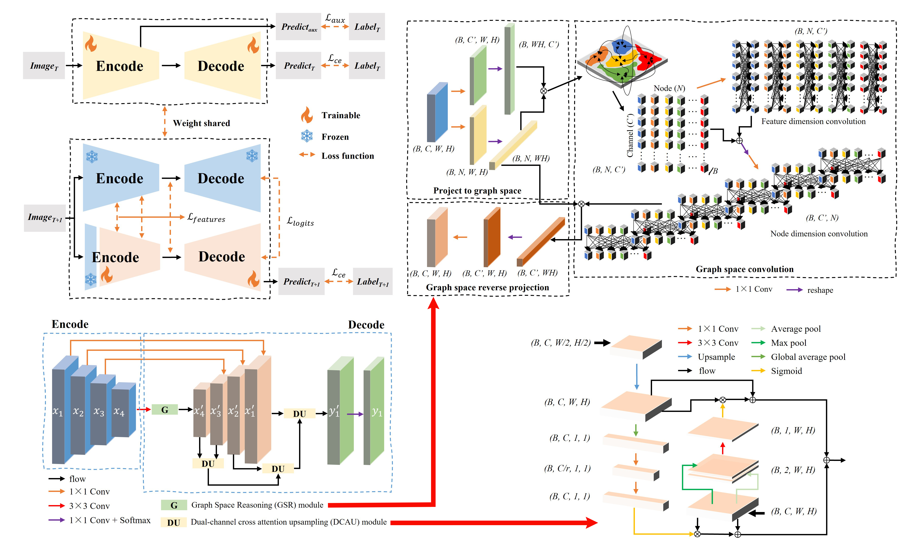
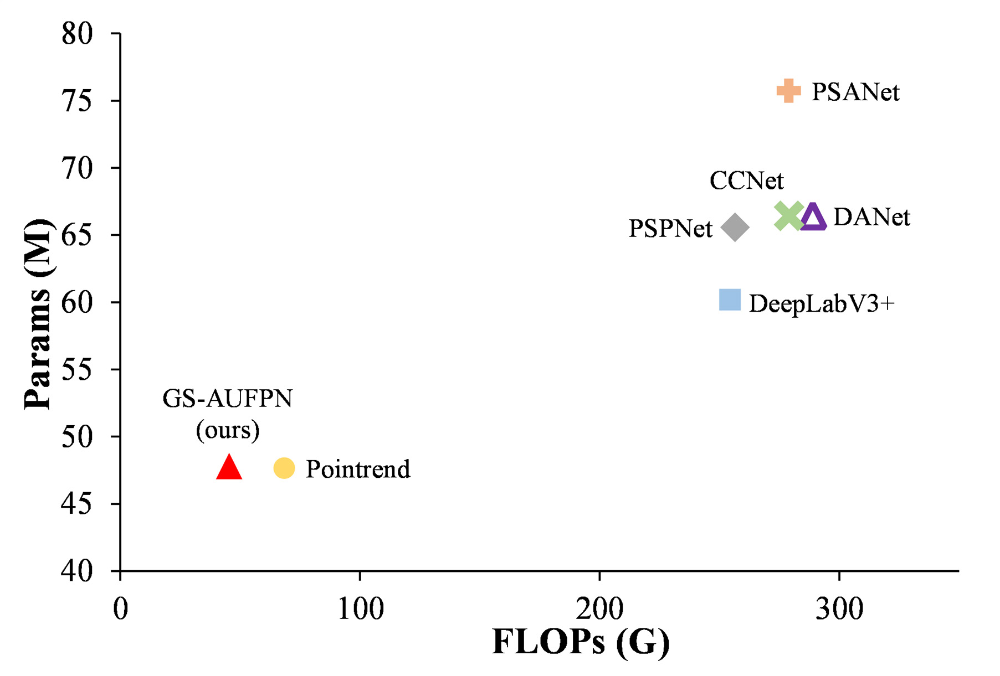
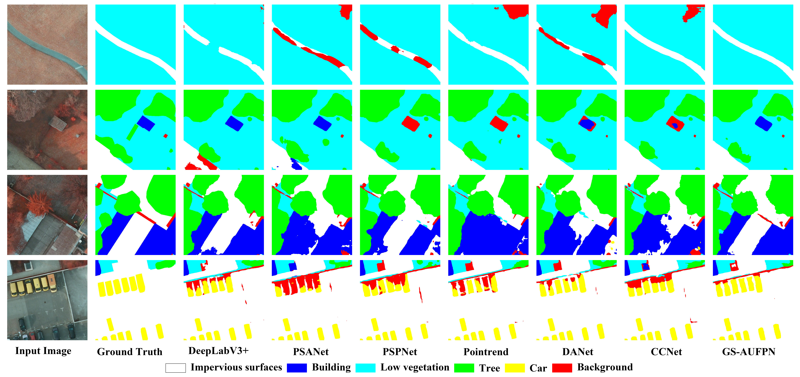
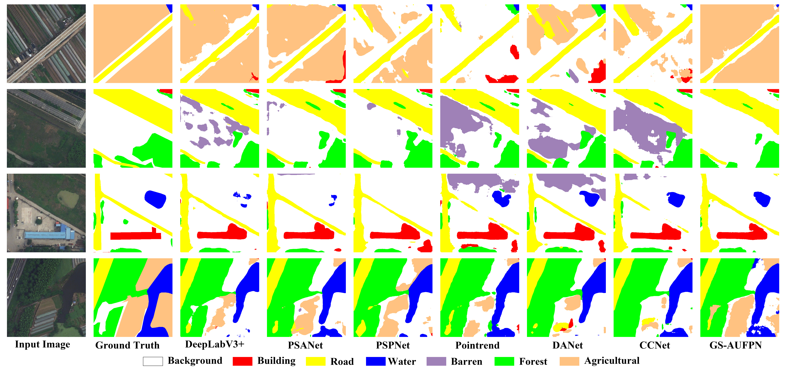

<div align="center">

<h1>Domain-Incremental Learning for Remote Sensing Semantic Segmentation with Multifeature Constraints in Graph Space</h1>

<div>
    <h3><strong>GSMF-RS-DIL</strong></h3>
</div>

<div>
    <strong>Wubiao Huang</strong>, Mingtao Ding, Fei Deng*
</div>

<div>
    <h4 align="center">
        This repository is an official implementation of  <a href="https://doi.org/10.1109/TGRS.2024.3481875" target='_blank'>[Paper]</a> <a href="https://github.com/HuangWBill/GSMF-RS-DIL/blob/master/paper.pdf" target='_blank'>[PDF]</a>
    </h4>
</div>

</div>


___________

## Table of Contents
* [News](#News)
* [Abstract](#Abstract)
* [Dependencies and installation](#Dependencies_and_installation)
* [Dataset](#Dataset)
* [Usage](#Usage)
* [Models and results](#Models_and_results)
* [Citation](#Citation)
* [Acknowledgement](#Acknowledgement)
* [Contact](#Contact)

___________

## News
- [2024-11-10] The **models** have been released.
- [2024-11-01] The **codes** have been released.
- [2024-10-14] The **paper** has been accepted by ***IEEE Transactions on Geoscience and Remote Sensing (TGRS)***.

## Abstract
> *The use of deep learning techniques for semantic segmentation in remote sensing has been increasingly prevalent. Effectively modeling remote contextual information and integrating high-level abstract features with low-level spatial features are critical challenges for semantic segmentation task. This paper addresses these challenges by constructing a Graph Space Reasoning (GSR) module and a Dual-channel Cross Attention Upsampling (DCAU) module. Meanwhile, a new domain incremental learning (DIL) framework is designed to alleviate catastrophic forgetting when the deep learning model is used in cross-domain. This framework makes a balance between retaining prior knowledge and acquiring new information through the use of frozen feature layers and multi-feature joint loss optimization. Base on this, a new domain incremental learning of remote sensing semantic segmentation with multifeature constraints in graph space (GSMF-RS-DIL) framework is proposed. Extensive experiments, including ablation experiments on the ISPRS and LoveDA datasets, demonstrate that the proposed method achieves superior performance and optimal computational efficiency in both single-domain and cross-domain tasks. The code is publicly available at https://github.com/HuangWBill/GSMF-RS-DIL.*

## Dependencies_and_installation

```bash
# 0. Basic environmental 
anaconda, cuda==11.1

# 1. create new anaconda env
conda create -n GSMF_RS_DIL python=3.8
conda activate GSMF_RS_DIL

# 2. git clone this repository
git clone https://github.com/HuangWBill/GSMF-RS-DIL.git
cd GSMF-RS-DIL

# 3. install torch and dependencies
pip install -r requirements.txt

# The mmcv, mmengine, mmsegmentation, torch, torchaudio and torchvision versions are strict.
```

## Dataset
<table>
<tr>
<th>Dataset</th><th>Class</th><th>Link</th><th>Storage path</th>
</tr>
<tr>
<td>Potsdam</td><td rowspan=2>impervious surfaces, building, low vegetation,tree, car, background</td><td rowspan=2> <a href="http://www2.isprs.org/commissions/comm3/wg4/semantic-label-ing.html" target='_blank'>[ISPRS]</a></td><td>data\Potsdam_IRRG_tif_512</td>
</tr>
<tr>
<td>Vaihingen</td><td>data\Vaihingen_IRRG_tif_512</td>
</tr>
<tr>
<td>Urban</td><td rowspan=2>buildings, road, water, barren, forest, agriculture, background</td><td rowspan=2> <a href="https://github.com/Junjue-Wang/LoveDA" target='_blank'>[LoveDA]</a></td><td>data\LoveDA_Urban_512</td>
</tr>
<tr>
<td>Rural</td><td>data\LoveDA_Rural_512</td>
</tr>
</table>

- The datasets used in the paper are all **publicly available** and can be downloaded and preprocessed according to the description in the paper.
- **Strictly** organize data according to the example data.
- The *ISPRS_IRRG* dataset consists of the *Potsdam* and *Vaihingen* datasets, the *LoveDA_all* dataset consists of the *Urban* and *Rural* datasets.
- GS-AUFPN experiment uses *Potsdam_IRRG_tif_512* or *LoveDA_Urban_512*, GSMF-RS-DIL experiment uses *ISPRS_IRRG_512* or *LoveDA_all_512*


## Usage
```shell
# train GS-AUFPN in Potsdam
python tools/train/train_GS-AUFPN.py --config configs/gs_aufpn_r101-d8_4xb4-80k_Potsdam-512x512.py --work-dir result/GS-AUFPN-Potsdam

# train GS-AUFPN in Urban
python tools/train/train_GS-AUFPN.py --config configs/gs_aufpn_r101-d8_4xb4-80k_Urban-512x512.py --work-dir result/GS-AUFPN-LoveDA_Urban

# test GS-AUFPN in Potsdam
python tools/test/test_GS-AUFPN.py --config configs/gs_aufpn_r101-d8_4xb4-80k_Potsdam-512x512.py --checkpoint result/GS-AUFPN-Potsdam/iter_80000_potsdam.pth --work-dir result/GS-AUFPN-Potsdam/result --out result/GS-AUFPN-Potsdam/result/dataset_pre  

# test GS-AUFPN in Urban
python tools/test/test_GS-AUFPN.py --config configs/gs_aufpn_r101-d8_4xb4-80k_Urban-512x512.py --checkpoint result/GS-AUFPN-LoveDA_Urban/iter_80000_urban.pth --work-dir result/GS-AUFPN-LoveDA_Urban/result --out result/GS-AUFPN-LoveDA_Urban/result/dataset_pre

# checkpoint format conversion
python tools/checkpoint_process.py --dataset_name 'ISPRS'
python tools/checkpoint_process.py --dataset_name 'LoveDA'

# train GSMF-RS-DIL in ISPRS
python tools/train/train_GSMF-RS-DIL.py --config configs/gsmf_rs_dil_r101-d8_4xb4-80k_ISPRS-512x512.py --work-dir result/GSMF-RS-DIL-ISPRS

# train GSMF-RS-DIL in LoveDA
python tools/train/train_GSMF-RS-DIL.py --config configs/gsmf_rs_dil_r101-d8_4xb4-80k_LoveDA-512x512.py --work-dir result/GSMF-RS-DIL-LoveDA

# test GSMF-RS-DIL in ISPRS
python tools/test/test_GSMF-RS-DIL.py --config configs/gsmf_rs_dil_r101-d8_4xb4-80k_ISPRS-512x512.py --checkpoint result/GSMF-RS-DIL-ISPRS/iter_10000_isprs.pth --work-dir result/GSMF-RS-DIL-ISPRS/result --out result/GSMF-RS-DIL-ISPRS/result/dataset_pre  

# test GSMF-RS-DIL in LoveDA
python tools/test/test_GSMF-RS-DIL.py --config configs/gsmf_rs_dil_r101-d8_4xb4-80k_LoveDA-512x512.py --checkpoint result/GSMF-RS-DIL-LoveDA/iter_10000_loveda.pth --work-dir result/GSMF-RS-DIL-LoveDA/result --out result/GSMF-RS-DIL-LoveDA/result/dataset_pre
```

## Models_and_results
- **train log and model download**
 
| Model       | Domain A               |  Domain B              | Device  | Iterations | mIoU of Domain A | mIoU of Domain B | Log                                                    | checkpoint                                                                                         |
| :---------: | :--------------------: | :--------------------: | :-----: | :--------: | :--------------: | :--------------: | :----------------------------------------------------: | :------------------------------------------------------------------------------------------------: |
| GS-AUFPN    | Potsdam_IRRG_tif_512   | ——                     | RTX4090 | 80000      | 74.87            | ——               | [log](./log/GS-AUFPN-Potsdam/20240331_190416.log)      | [download](https://zenodo.org/records/13950503/files/iter_80000_potsdam.pth?download=1&preview=1)  |
| GS-AUFPN    | Vaihingen_IRRG_tif_512 | ——                     | RTX4090 | 80000      | 69.77            | ——               | [log](./log/GS-AUFPN-Vaihingen/20240402_120940.log)    | [download](https://zenodo.org/records/13950503/files/iter_80000_vaihingen.pth?download=1&preview=1)|
| GS-AUFPN    | LoveDA_Urban_512       | ——                     | RTX4090 | 80000      | 44.41            | ——               | [log](./log/GS-AUFPN-LoveDA_Urban/20240413_172749.log) | [download](https://zenodo.org/records/13950503/files/iter_30000_urban.pth?download=1&preview=1)    |
| GS-AUFPN    | LoveDA_Rural_512       | ——                     | RTX4090 | 80000      | 35.89            | ——               | [log](./log/GS-AUFPN-LoveDA_Rural/20240416_190741.log) | [download](https://zenodo.org/records/13950503/files/iter_30000_rural.pth?download=1&preview=1)    |
| GSMF-RS-DIL | Potsdam_IRRG_tif_512   | Vaihingen_IRRG_tif_512 | RTX4090 | 80000      | 61.91            | 65.81            | [log](./log/GSFM-RS-DIL-ISPRS/20240524_213132.log)     | [download](https://zenodo.org/records/13950503/files/iter_10000_isprs.pth?download=1&preview=1)    |
| GSMF-RS-DIL | LoveDA_Urban_512       | LoveDA_Rural_512       | RTX4090 | 80000      | 51.02            | 36.21            | [log](./log/GSMF-RS-DIL-LoveDA/20240527_084944.log)    | [download](https://zenodo.org/records/13950503/files/iter_10000_loveda.pth?download=1&preview=1)   |

- **Results of single domain**
> Table 1. Quantitative comparison results with State-of-the-art network.
<table>
<tr>
<th rowspan=2>Method</th><th colspan=3>Potsdam</th><th colspan=3>Urban</th>
</tr>
<tr>
<td align="center">OA (%)</td><td align="center">mF1 (%)</td><td align="center">mIoU (%)</td><td align="center">OA (%)</td><td align="center">mF1 (%)</td><td align="center">mIoU (%)</td>
</tr>
<tr>
<td align="center">DeepLabV3+</td><td align="center">88.65</td><td align="center">83.52</td><td align="center">73.94</td><td align="center">56.82</td><td align="center">58.63</td><td align="center">43.76</td>
</tr>
<tr>
<td align="center">PSANet</td><td align="center">88.62</td><td align="center">83.92</td><td align="center">74.25</td><td align="center">57.60</td><td align="center">59.16</td><td align="center">44.27</td>
</tr>
<tr>
<td align="center">PSPNet</td><td align="center">88.69</td><td align="center">83.77</td><td align="center">74.16</td><td align="center">56.91</td><td align="center">58.29</td><td align="center">43.38</td>
</tr>
<tr>
<td align="center">Pointrend</td><td align="center">88.21</td><td align="center">82.12</td><td align="center">72.51</td><td align="center">54.43</td><td align="center">56.35</td><td align="center">42.55</td>
</tr>
<tr>
<td align="center">DANet</td><td align="center">88.44</td><td align="center">83.01</td><td align="center">73.38</td><td align="center">56.21</td><td align="center">58.43</td><td align="center">43.62</td>
</tr>
<tr>
<td align="center">CCNet</td><td align="center">88.56</td><td align="center">83.38</td><td align="center">73.77</td><td align="center">55.95</td><td align="center">58.20</td><td align="center">43.91</td>
</tr>
<tr>
<td align="center">GS-AUFPN (ours)</td><td align="center">88.72</td><td align="center">84.56</td><td align="center">74.87</td><td align="center">57.43</td><td align="center">59.71</td><td align="center">44.41</td>
</tr>
</table>







- **Results of cross domain**
> Table 2. Quantitative comparison results with other cross domain training methods.
<table>
<tr>
<th rowspan=2> </th><th colspan=2>Potsdam</th><th colspan=2>Vaihingen</th><th rowspan=2>Δ<sub>mIoU</sub>(%)</th><th rowspan=8> </th><th colspan=2>Urban</th><th colspan=2>Rural</th><th rowspan=2>Δ<sub>mIoU</sub>(%)</th>
</tr>
<tr>
<td align="center">mIoU(%)</td><td align="center">Δ<sup>b</sup><sub>mIoU</sub>(%)</td><td align="center">mIoU(%)</td><td align="center">Δ<sup>b</sup><sub>mIoU</sub>(%)</td><td align="center">mIoU(%)</td><td align="center">Δ<sup>b</sup><sub>mIoU</sub>(%)</td><td align="center">mIoU(%)</td><td align="center">Δ<sup>b</sup><sub>mIoU</sub>(%)</td>
</tr>
<tr>
<td align="center">Single task (A-A)</td><td align="center">74.87</td><td align="center">——</td><td align="center">69.77</td><td align="center">——</td><td align="center">——</td><td align="center">44.41</td><td align="center">——</td><td align="center">35.89</td><td align="center">——</td><td align="center">——</td>
</tr>
<tr>
<td align="center">Single task (A-B)</td><td align="center">——</td><td align="center">——</td><td align="center">28.09</td><td align="center">-59.74</td><td align="center">——</td><td align="center">——</td><td align="center">——</td><td align="center">28.52</td><td align="center">-20.54</td><td align="center">——</td>
</tr>
<tr>
<td align="center">Multi task</td><td align="center">74.45</td><td align="center">-00.56</td><td align="center">66.84</td><td align="center">-4.20</td><td align="center">-2.38</td><td align="center">53.91</td><td align="center">+21.39</td><td align="center">35.71</td><td align="center">-0.50</td><td align="center">+10.45</td>
</tr>
<tr>
<td align="center">Fine-tune</td><td align="center">54.82</td><td align="center">-26.78</td><td align="center">67.21</td><td align="center">-3.67</td><td align="center">-15.22</td><td align="center">49.92</td><td align="center">+12.41</td><td align="center">35.26</td><td align="center">-1.76</td><td align="center">+5.33</td>
</tr>
<tr>
<td align="center">LwF</td><td align="center">62.53</td><td align="center">-16.48</td><td align="center">63.8</td><td align="center">-8.55</td><td align="center">-12.52</td><td align="center">49.92</td><td align="center">+12.41</td><td align="center">34.82</td><td align="center">-2.98</td><td align="center">+4.71</td>
</tr>
<tr>
<td align="center">GSMF-RS-DIL (ours)</td><td align="center">61.91</td><td align="center">-17.31</td><td align="center">65.81</td><td align="center">-5.67</td><td align="center">-11.49</td><td align="center">51.02</td><td align="center">+14.84</td><td align="center">36.21</td><td align="center">+0.89</td><td align="center">+7.89</td>
</tr>
</table>


## Citation
Please kindly cite the papers if this code is useful and helpful for your research: 
```
@article{huang2024gsmfrsdil,
  title = {Domain Incremental Learning for Remote Sensing Semantic Segmentation with Multi-Feature Constraints in Graph Space},
  author = {Huang, Wubiao and Ding, Mingtao and Deng, Fei},
  journal = {IEEE Transactions on Geoscience and Remote Sensing},
  volume = {},
  number = {},
  pages = {},
  year = {2024},
  DOI = {10.1109/TGRS.2024.3481875}
}
```

## Acknowledgement
This implementation is based on [MMSegmentation](https://github.com/open-mmlab/mmsegmentation). Thanks for the awesome work.

## Contact
If you have any questions or suggestions, feel free to contact [Wubiao Huang](huangwubiao@whu.edu.cn).

